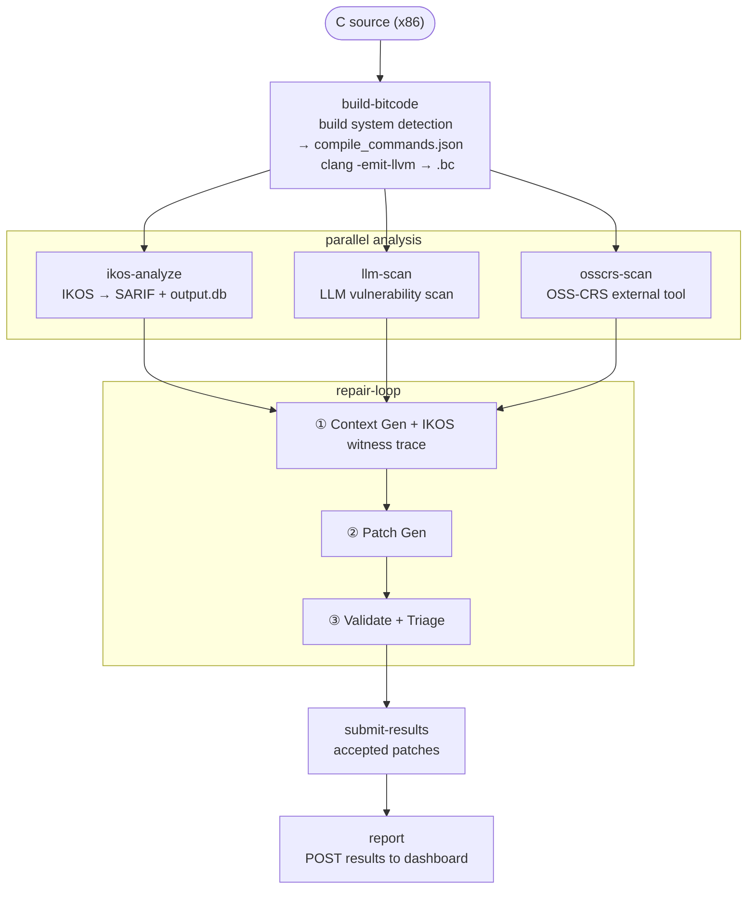

# SCAR — Static C Analysis & Repair

Autonomous CVE scanning and patch generation for C codebases, orchestrated via OpenShift Pipelines (Tekton).

## Architecture



`ikos-analyze`, `llm-scan`, and `osscrs-scan` run in parallel after bitcode
compilation. The repair loop merges all finding sources, deduplicates with a
±3-line sliding window, and drives each finding through the three-stage LLM
repair pipeline.

## Components

| Module | Role |
|---|---|
| `scar/sarif_bridge.py` | Parses IKOS SARIF output into structured findings |
| `scar/ikos_witness.py` | Queries IKOS `output.db` (SQLite) for counterexample witness traces |
| `scar/context_gen.py` | Security briefing per file, enriched with grep results and IKOS witness traces |
| `scar/vuln_scan.py` | LLM-driven vulnerability discovery (nano-analyzer Stage 2) |
| `scar/scan_cmd.py` | Entry point for the `scar-llm-scan` Tekton task |
| `scar/patch_gen.py` | Synthesises a unified diff patch via LLM |
| `scar/triage.py` | Multi-round skeptical triage + Arbiter verdict (nano-analyzer Stage 3) |
| `scar/validator.py` | Enforces MISRA safety rules and verifies compilation via `compile_commands.json` |
| `scar/grep_tool.py` | Agentic grep — lets the LLM resolve `#define` constants across the repo |
| `scar/llm.py` | OpenAI-compatible client (LiteLLM, OpenAI, OpenRouter, vLLM) |
| `scar/libCRS_bridge/libCRS.py` | OSS-CRS libCRS shim — intercepts submissions and normalises to SCAR findings schema |

## Three scanning approaches

### IKOS static analysis (sound)

[NASA IKOS](https://github.com/NASA-SW-VnV/ikos) uses abstract interpretation to *prove* a bug is definitely present — no false positives for the checkers it runs.

| Checker | CWE | Description |
|---|---|---|
| `boa` | CWE-121, CWE-125 | Buffer overflow / out-of-bounds array access |
| `dbz` | CWE-369 | Divide by zero |
| `nullity` | CWE-476 | Null pointer dereference |
| `uva` | CWE-457 | Read of uninitialized variable |
| `sio` | CWE-190 | Signed integer overflow (undefined behaviour in C) |
| `dfa` | CWE-415, CWE-416 | Double free and use-after-free |

cppcheck runs alongside IKOS as a supplementary pass (output stored as `.scar/cppcheck.xml`).

Before running IKOS, all library translation units are merged with `llvm-link` into
a single `whole_program.bc`. This gives IKOS full interprocedural visibility — it can
trace a buffer filled in `parse.c` through a call into `session.c` — rather than
stopping at module boundaries.

IKOS writes `whole_program.db` — a SQLite database containing the abstract interval
state at each flagged statement. SCAR reads this via `ikos_witness.py` and injects
the counterexample trace (checker, status, call context) into the context generation
prompt, giving the LLM proven execution data rather than requiring it to re-derive
the path from source alone.

### LLM vulnerability scan (broad)

Inspired by [nano-analyzer](https://github.com/weareaisle/nano-analyzer), the LLM scan
runs independently on every C file in `source-dir`, hunting for bug classes IKOS cannot
model: string function overflows, type confusion, logic errors, and protocol-level bugs.
Findings are few-shot prompted, then deduplicated against IKOS results before entering the
repair loop. Each accepted patch is tagged `[ikos]` or `[llm]` to indicate its origin.

### OSS-CRS external tool integration

SCAR implements the [OSS-CRS](https://openssf.org/projects/open-source-crs/) libCRS API
so it can run alongside — and consume findings from — any tool that participated in the
[AIxCC](https://aicyberchallenge.com/) competition or the wider OSS-CRS ecosystem.

#### SCAR as an OSS-CRS participant

When SCAR's repair loop runs inside an OSS-CRS environment, it automatically:

- Calls `libCRS.register_submit_dir("patch", ...)` at startup so the CRS ensemble
  collects accepted patches.
- Calls `libCRS.register_fetch_dir("bug-candidate", ...)` so it ingests findings from
  other tools in the ensemble.
- Calls `libCRS.submit("patch", <file>)` for every accepted patch.

If libCRS is not on `PYTHONPATH` (standalone Tekton mode), SCAR falls back gracefully —
no code changes needed.

#### Running an external OSS-CRS tool (osscrs-scan task)

The `osscrs-scan` task provides two integration patterns:

**Pattern A — same container (tool bundled in scar-agent image)**

Install the tool into the scar-agent image and point `tool-cmd` at it. Good for
pure-Python tools with light dependencies.

```dockerfile
# containers/scar/Dockerfile.atlantis (copy of Dockerfile.osscrs-tool.example)
FROM quay.io/jwesterl/scar-agent:latest
RUN pip3 install --no-cache-dir atlantis-scanner==1.2.3
```

```bash
tkn pipeline start scar \
  --param tool-image=quay.io/jwesterl/scar-atlantis:latest \
  --param tool-cmd="python3 -m atlantis_scan --target \$SANDBOX_SRC" \
  ...
```

**Pattern B — external container (bridge injected at runtime)**

Use the tool's own published image unchanged. The `inject-bridge` step copies the
libCRS shim from the scar-agent image into the shared PVC; the tool's container then
picks it up via `PYTHONPATH`. No modifications to the upstream image are needed.

```bash
tkn pipeline start scar \
  --param tool-image=ghcr.io/team-atlantis/scanner:latest \
  --param tool-cmd="/usr/local/bin/their-scanner --src \$SANDBOX_SRC" \
  ...
```

In both patterns the bridge intercepts `libCRS.submit('bug-candidate', ...)` calls,
normalises the payload to SCAR's findings schema, and writes
`.scar/findings-osscrs-<ts>.json` — which the repair loop discovers automatically.

The source is sandboxed to `/tmp/osscrs-sandbox` before the tool runs, so destructive
verification steps cannot corrupt the shared PVC.

## Build system support

`build-bitcode` runs as two steps:

1. **detect-build-system** (bash) — detects the project's build system and generates
   `compile_commands.json` with exact per-file compiler flags.
2. **emit-llvm** (Python) — reads `compile_commands.json` and emits one `.bc` bitcode
   file per C source, passing the captured `-I`, `-D`, `-std=`, `-isystem`, and
   `-iquote` flags to clang verbatim.

| Detected file | Action |
|---|---|
| `CMakeLists.txt` | `cmake -DCMAKE_EXPORT_COMPILE_COMMANDS=ON` (no full build needed) |
| `Makefile` | `bear -- make` intercepts compiler calls |
| `build.sh` | OSS-Fuzz compatible — runs with `bear` and standard env vars (`$CC`, `$CFLAGS`, `$SRC`, `$WORK`, `$OUT`) |
| none | Falls back to standalone `clang -emit-llvm` per file |

Per the [LLVM compilation database spec](https://clang.llvm.org/docs/JSONCompilationDatabase.html),
the `file` field may be relative to the entry's `directory` field. SCAR always resolves
both together before lookup, so projects with out-of-tree builds work correctly.

This enables SCAR to scan any project in the [OSS-Fuzz](https://github.com/google/oss-fuzz)
corpus (1,000+ open-source C projects) without per-project configuration.

## Pluggable findings convention

Any Tekton task can contribute findings to the repair loop by writing a file matching
`.scar/findings-<name>.json` using this schema:

```json
[
  {
    "rule_id": "CWE-121",
    "severity": "high",
    "file_path": "/workspace/source/src/input.c",
    "line": 12,
    "column": 0,
    "message": "strcpy into fixed-size buffer without length check"
  }
]
```

The repair loop discovers all `findings-*.json` files automatically — no Python changes
needed when a new analyzer or fuzzer is added to the pipeline. To add a new tool:

1. Write a Tekton Task that produces `.scar/findings-<name>.json`
2. Add it to `pipeline.yaml` with `runAfter: [build-bitcode]`
3. Add it to the `runAfter` list on `repair-loop`

## What SCAR does not find

- **String function overflows via IKOS** — IKOS does not model string lengths; `strcpy` into a fixed buffer won't be flagged by the static checker. The LLM scan covers this gap.
- **Race conditions / TOCTOU** (CWE-362) — outside both IKOS and the LLM scan's reliable coverage.
- **Cross-platform / non-x86 targets** — SCAR compiles and analyses x86 bitcode only.

## Test corpus

### johwes/scar-test-c

[`johwes/scar-test-c`](https://github.com/johwes/scar-test-c) — two test targets:

**Single-file (root of repo)**

Minimal C files, one vulnerability each, covering all active checkers:

| File | CWE | IKOS | LLM scan |
|---|---|---|---|
| `bof.c` | CWE-121 (`strcpy`) | not detected | detected |
| `oob_read.c` | CWE-125 | `boa` | detected |
| `divzero.c` | CWE-369 | `dbz` | detected |
| `nullderef.c` | CWE-476 | `nullity` | detected |
| `uninit.c` | CWE-457 | `uva` | detected |
| `signedoverflow.c` | CWE-190 | `sio` | detected |
| `doublefree.c` | CWE-415 | `dfa` | detected |

**Multi-file (`multifile/`)**

Three source files sharing a common header (`include/common.h`), built via an
OSS-Fuzz `build.sh`. Tests the full build system detection and `compile_commands.json`
pipeline — without the `-Iinclude` flag captured by bear, all three patches would fail
compilation.

| File | CWE | IKOS | LLM scan |
|---|---|---|---|
| `src/input.c` | CWE-121 (`strcpy`) | not detected | detected |
| `src/process.c` | CWE-476 | `nullity` | detected |
| `src/output.c` | CWE-369 | `dbz` | detected |

### Pluggable Ecosystem Testing

To validate SCAR's ability to ingest external vulnerabilities, you can leverage any third-party tool designed for the OpenSSF OSS-CRS framework (such as fuzzers, symbolic execution engines, or specialized static analyzers that competed in DARPA's AIxCC).

By utilizing **Pattern B runtime injection**, you can point SCAR directly at an unmodified upstream container image of an external tool, set the corresponding parameters, and verify that the `libCRS` bridge seamlessly captures, normalizes, and patches the foreign findings tracker.

For a comprehensive blueprint on writing, testing, and plugging an external tool into the pipeline, see [`docs/osscrs-tool-guide.md`](docs/osscrs-tool-guide.md).

## Configuration

Create a Kubernetes secret with your OpenAI-compatible LLM endpoint:

```bash
oc create secret generic scar-llm-credentials \
  --from-literal=base_url="https://your-llm-endpoint/v1" \
  --from-literal=api_key="sk-your-api-key" \
  --from-literal=patch_model="your-patch-model-name" \
  --from-literal=review_model="your-review-model-name"
```

`patch_model` is used for generation tasks (context briefing, patch synthesis, LLM scan).
`review_model` is used for review tasks (triage rounds, arbiter verdict). Using a different
model for each role improves patch quality — the reviewer brings independent judgment rather
than being consistent with the generator's own blind spots. If you only have one model,
set both to the same value.

Any OpenAI-compatible endpoint works: LiteLLM proxy, OpenAI, OpenRouter, vLLM, etc.

## Competition Dashboard

A lightweight FastAPI dashboard collects pipeline results from all teams and displays a
live leaderboard. Each team's `report` task POSTs its metrics to the dashboard at the
end of every run. Teams are identified by their OpenShift namespace.

### Scoring

| Signal | Points |
|---|---|
| Each accepted patch | ×3 |
| Each unique CWE class fixed | ×2 |
| Each distinct scanner type that contributed a finding | ×1 (tool diversity bonus) |

When teams are tied on score, tiebreakers are: fewest cumulative tokens (across all
runs for that team), then fastest single-run time.

### Deploy on OpenShift

```bash
# Build and push the dashboard image
podman build -t quay.io/jwesterl/scar-dashboard:latest containers/dashboard/
podman push quay.io/jwesterl/scar-dashboard:latest

# Deploy on the cluster
oc new-app --image=quay.io/jwesterl/scar-dashboard:latest --name=scar-dashboard
oc expose svc/scar-dashboard
```

Pipeline pods run inside the cluster, so the ConfigMap should point to the
**internal service DNS name** rather than the public Route. This avoids external
egress and works even without an exposed Route:

```bash
# ConfigMap for pipeline runs — uses cluster-internal service URL
oc create configmap scar-dashboard \
  --from-literal=url="http://scar-dashboard:8080"
```

The ConfigMap must be named `scar-dashboard` with key `url`. That exact name and key
are what the `report` task reads via `configMapKeyRef`.

```bash
# The Route URL is for browser access to the leaderboard only
ROUTE=$(oc get route scar-dashboard -o jsonpath='{.spec.host}')
echo "Leaderboard at http://$ROUTE"
```

If the `scar-dashboard` ConfigMap is absent from a team's namespace the `report` task
prints `[report] DASHBOARD_URL not configured — skipping submission` and exits cleanly
— the pipeline does not abort.

### Run locally (development)

```bash
cd containers/dashboard
pip install -r requirements.txt
uvicorn app:app --host 0.0.0.0 --port 8080 --reload
```

Endpoints: `GET /` (leaderboard HTML, auto-refreshes every 30 s), `GET /leaderboard`
(JSON), `POST /submit` (pipeline → dashboard), `GET /runs/{team_id}`.

## Running the Tekton Pipeline

### 1. Apply pipeline resources

```bash
# Shared workspace PVC
oc apply -f pipeline/pvc.yaml

# All task definitions (includes report, stub-fuzzer, stub-custom-scan)
oc apply -f pipeline/tasks/

# Choose a pipeline variant — apply one:
oc apply -f pipeline/pipeline-v1-llm-only.yaml   # LLM scan only, fastest
oc apply -f pipeline/pipeline-v2-full.yaml        # IKOS + LLM + OSS-CRS (recommended)
oc apply -f pipeline/pipeline-v3-extended.yaml    # v2 + stub slots for student tools
```

| Variant | Pipeline name | Analyzers |
|---|---|---|
| `pipeline-v1-llm-only.yaml` | `scar-v1` | LLM scan only |
| `pipeline-v2-full.yaml` | `scar-v2` | IKOS + LLM + OSS-CRS |
| `pipeline-v3-extended.yaml` | `scar-v3` | v2 + fuzzer-stub + custom-scan-stub |

### 2. Build and push container images

```bash
# scar-ikos — rebuild only when the base IKOS image changes
podman build -t quay.io/jwesterl/scar-ikos:latest containers/ikos/
podman push quay.io/jwesterl/scar-ikos:latest

# scar-agent — rebuild after any change to scar/ Python source or task scripts
podman build -t quay.io/jwesterl/scar-agent:latest containers/scar/
podman push quay.io/jwesterl/scar-agent:latest

# scar-dashboard — rebuild after any change to containers/dashboard/
podman build -t quay.io/jwesterl/scar-dashboard:latest containers/dashboard/
podman push quay.io/jwesterl/scar-dashboard:latest
```

### 3. Create credentials

See [Configuration](#configuration) above for the LLM secret, and
[Competition Dashboard](#competition-dashboard) above for the dashboard ConfigMap.

### 4. Start a pipeline run

```bash
# v1 — LLM scan only (quickest, good for a first test)
tkn pipeline start scar-v1 \
  --param repo-url=https://github.com/johwes/scar-test-c \
  --workspace name=shared-data,claimName=scar-pvc \
  --showlog

# v2 — full pipeline, single-file test corpus
tkn pipeline start scar-v2 \
  --param repo-url=https://github.com/johwes/scar-test-c \
  --workspace name=shared-data,claimName=scar-pvc \
  --showlog

# v2 — multi-file OSS-Fuzz example
tkn pipeline start scar-v2 \
  --param repo-url=https://github.com/johwes/scar-test-c \
  --param source-dir=multifile \
  --workspace name=shared-data,claimName=scar-pvc \
  --showlog

# v2 — scarnet test corpus
tkn pipeline start scar-v2 \
  --param repo-url=https://github.com/johwes/scarnet \
  --workspace name=shared-data,claimName=scar-pvc \
  --showlog

# v2 — with an external OSS-CRS tool (Pattern B — unmodified upstream image)
tkn pipeline start scar-v2 \
  --param repo-url=https://github.com/johwes/scar-test-c \
  --param tool-image=ghcr.io/example/osscrs-tool:latest \
  --param tool-cmd="/usr/local/bin/scanner --src \$SANDBOX_SRC" \
  --workspace name=shared-data,claimName=scar-pvc \
  --showlog

# v3 — student extension stubs included
tkn pipeline start scar-v3 \
  --param repo-url=https://github.com/johwes/scar-test-c \
  --workspace name=shared-data,claimName=scar-pvc \
  --showlog
```

The `report` task at the end of every variant automatically POSTs results to the
dashboard if the `scar-dashboard` ConfigMap is present in the namespace.

## Quick Start (CLI)

```bash
pip install -e .

scar results.sarif /path/to/repo \
  --triage-rounds 5 \
  --min-confidence 0.6 \
  --output patches.json
```

## Running Tests

```bash
pip install -e ".[dev]"
pytest
```

## Improvements roadmap

See [`IMPROVEMENTS.md`](IMPROVEMENTS.md) for a prioritised list of enhancements from
low-hanging fruit (IKOS witness traces, macro expansion) through medium effort (caller
context injection, RAG over accepted patches, parallel repair loop) to higher complexity
(program slicing, cross-file data flow, reachability filtering, ESBMC integration,
fuzzer-driven triage, and ARM cross-compilation).

