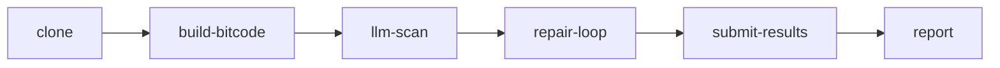
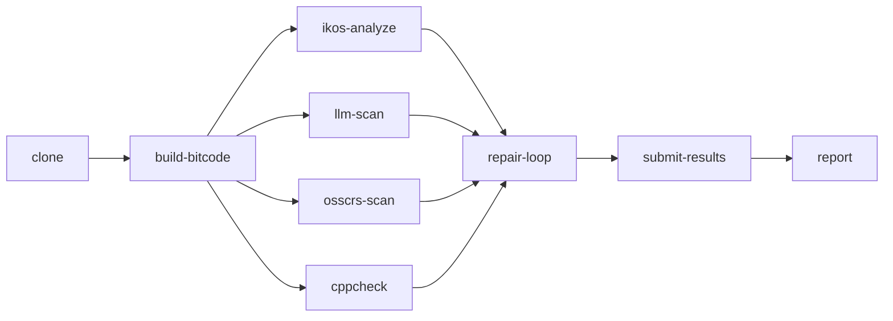
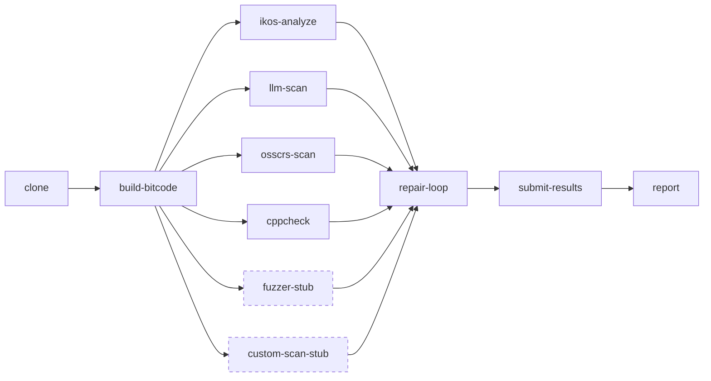

# SCAR Pipeline Variants

Three pipeline definitions ship with SCAR. Each builds on the previous by
adding parallel analysis tasks after `build-bitcode`.

| File | Tekton name | What runs |
|---|---|---|
| `pipeline-v1-llm-only.yaml` | `scar-v1` | LLM vulnerability scan only |
| `pipeline-v2-full.yaml` | `scar-v2` | + IKOS + cppcheck + OSS-CRS tool |
| `pipeline-v3-extended.yaml` | `scar-v3` | + two student extension slots |

All three share the same repair loop: context generation → patch synthesis →
validate + triage → submit → report.

---

## scar-v1 — LLM only

The baseline. Compiles to bitcode (to capture `compile_commands.json` for the
validator), runs the LLM scan, then repairs. No static analysis.

---

## scar-v2 — Full pipeline

Adds three analysis tasks that run in parallel with `llm-scan` after bitcode
compilation. The repair loop waits for all four before starting.

| Task | Approach | Findings |
|---|---|---|
| `ikos-analyze` | IKOS sound abstract interpretation | SARIF (consumed directly) |
| `llm-scan` | LLM scan per file | `findings-llm-scan.json` |
| `osscrs-scan` | OSS-CRS external tool (configurable) | `findings-osscrs-<ts>.json` |
| `cppcheck` | cppcheck intra-procedural analysis | `findings-cppcheck.json` |

---

## scar-v3 — Extended (student extension slots)

Identical to v2 plus two pre-wired stub tasks. Replace either stub with a
real tool — the repair loop picks up its output automatically via the
`findings-<name>.json` convention. No changes to the pipeline YAML needed.

The dashed nodes are stubs — starting points for the workshop extension tasks.
See [`docs/extending-the-pipeline.md`](../docs/extending-the-pipeline.md) for
the task skeleton, findings schema, and wiring instructions.

---

## Adding your own task

Any Tekton task that writes `.scar/findings-<name>.json` feeds the repair loop
without any Python changes. Three steps:

1. Write the task YAML in `pipeline/tasks/`
2. Add it to `runAfter: [build-bitcode]` in `pipeline-v2-full.yaml` or `pipeline-v3-extended.yaml`
3. Add it to the `repair-loop` `runAfter` list

**The findings filename must be unique across all parallel tasks** — they share
the same PVC with no file-level locking. See the table above for names already
in use.
